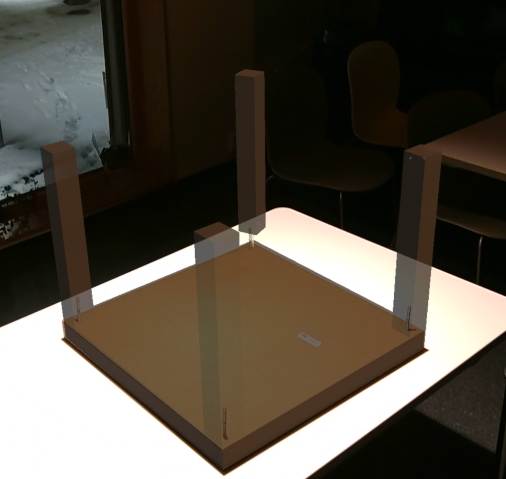
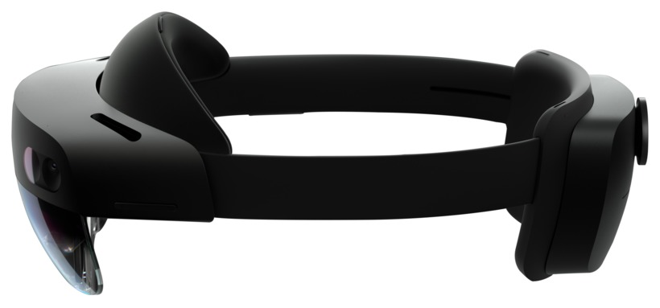

# Experts in Teamwork

> Group Project With:
>
> - Jostein Hjortland Tysse
> - Audun Ryland
> - Krisitan Hansen
> - Kristin Wahl

## VR Village - Visualization of Petroleum-related Data

For further information, see [ntnu.edu/eit](www.ntnu.edu/eit) and [ntnu.edu/eit/course-description](www.ntnu.edu/eit/course-description)

## Product

An Augmented-Reality Application for Microsoft Hololens for assembling IKEA furniture. You can view the [demonstration video on YouTube](https://www.youtube.com/watch?v=e9pUjq5JiHY).

    

    

